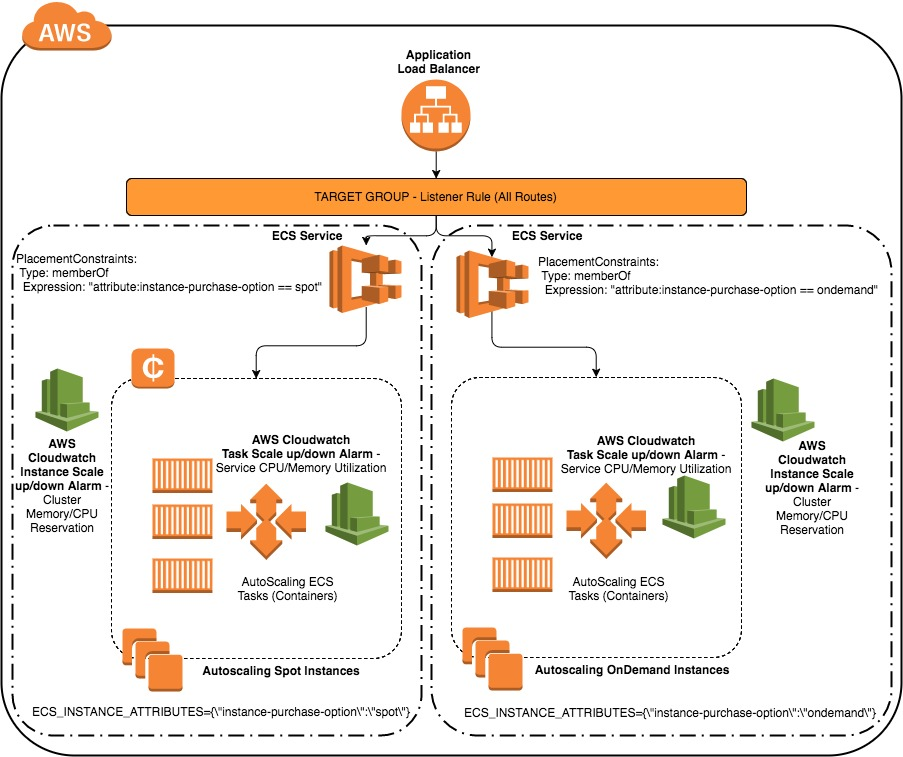

 

# Powering your Amazon ECS Cluster with a mix of Amazon EC2 Spot Instances and Amazon EC2 OnDemand Instances with independent AutoScaling

## Getting Started

This CloudFormation template will deploy two ECS Clusters, one with OnDemand Instances and another with Spot Instances.
The respective ECS Services running tasks at the respective clusters registers the containers with the same target group, thereby routing traffic to on-demand and spot instances.
The respective ECS Service uses CPU Utilization and Memory Utilization metrics to increase/decrease the number of tasks.
Respective cluster's CPU Reservation and Memory Reservation Metrics are used to independently increase/decrease the number of instances (spot or on-demand).
UserData for spot instance LaunchConfiguration runs a script, which listens to EC2 Spot Instance termination notice to automatically set the ECS container instances in **DRAINING** state when a Spot Instance termination notice is detected. The handler script also publishes a message to an SNS topic created by the CloudFormation stack.

### Architecture

[][architecture]

### Prerequisites

Before you can use AWS CloudFormation or any Amazon Web Services, you must first sign up for an AWS account.

To sign up for an AWS account, open [https://aws.amazon.com/](https://aws.amazon.com/), and then choose **Create an AWS Account**.

Follow the online instructions.

### Pricing

AWS CloudFormation is a free service; however, you are charged for the AWS resources you include in your stacks at the current rates for each. For more information about AWS pricing, go to the detail page for each product on [http://aws.amazon.com](http://aws.amazon.com).

## Deployment

After signing up for an AWS account, you can use AWS CloudFormation through the AWS Management Console, AWS CloudFormation API, or AWS CLI.

Use the [template](ecs-spot-asg-two-cluster.yaml) to create a CloudFormation stack, providing details and parameters such as the **ECS cluster target capacity**, the **instance type**, and the **Spot bid price**.

You can learn more about working with CloudFormation stacks [here](http://docs.aws.amazon.com/AWSCloudFormation/latest/UserGuide/stacks.html).

## AWS services used

* [AWS CloudFormation](https://aws.amazon.com/cloudformation/)
* [Amazon EC2 Container Service (ECS)](https://aws.amazon.com/ecs/)
* [Amazon EC2 Spot Instances](https://aws.amazon.com/ec2/spot/)
* [Amazon CloudWatch](https://aws.amazon.com/cloudwatch/)
* [Amazon Simple Notification Service (SNS)](https://aws.amazon.com/sns/)

## Contributing

Comments, feedback, and pull requests are always welcome.

## Authors

* [**Anuj Sharma**](https://github.com/anshrma)

## License

This project is licensed under the [Amazon Software License](https://aws.amazon.com/asl/) - see the [LICENSE.txt](LICENSE.txt) file for details.
